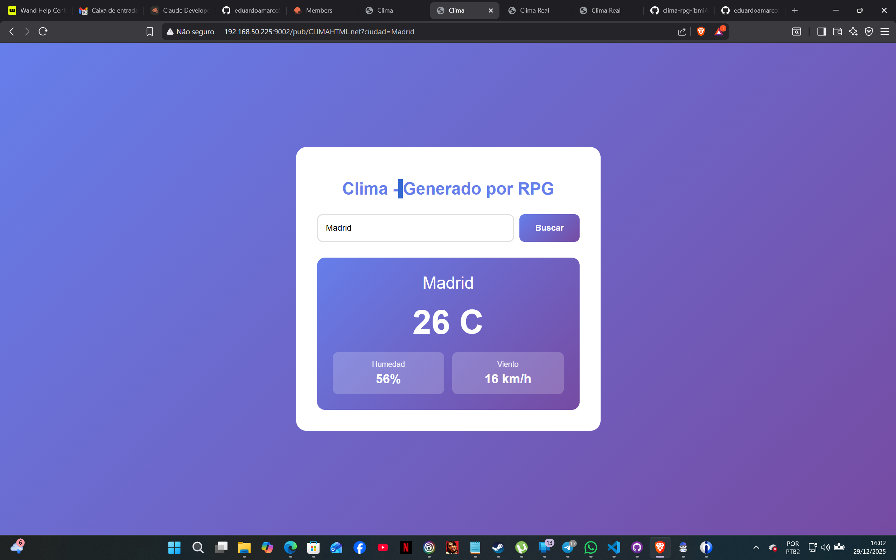

# 🌤️ Clima Real - API REST en RPG para IBM i

Aplicación web de clima que obtiene datos reales de OpenWeatherMap usando RPG Free Format en IBM i.

## 🎯 Características

- ✅ **Datos reales** de OpenWeatherMap API
- ✅ **Sin problemas de CCSID** - HTML embebido
- ✅ **RPG Free Format** - Código moderno
- ✅ **CGIDEV2** - Framework CGI para IBM i
- ✅ **HTTPAPI** - Cliente HTTP de Scott Klement
- ✅ **Diseño responsive** - CSS moderno
- ✅ **Formulario funcional** - Buscar cualquier ciudad

## 📋 Requisitos

### Software necesario:
- IBM i V7R3 o superior
- Apache HTTP Server configurado
- CGIDEV2 instalado
- HTTPAPI (Scott Klement) instalado

### API Key:
- Cuenta gratuita en [OpenWeatherMap](https://openweathermap.org/api)

## 🚀 Instalación Rápida

### 1. Clonar el repositorio

```bash
git clone https://github.com/tu-usuario/clima-rpg-ibmi.git
cd clima-rpg-ibmi
```

### 2. Configurar Apache

Editar `/www/tu-instancia/conf/httpd.conf`:

```apache
ScriptAliasMatch /pub/(.*)\.net(.*)  /QSYS.LIB/TULIB.LIB/$1.PGM$2

<Directory /QSYS.LIB/TULIB.LIB>
   order allow,deny
   allow from all
   SetEnv QIBM_CGI_LIBRARY_LIST "QTEMP;TULIB;CGIDEV2;LIBHTTP;QGPL;"
</Directory>
```

### 3. Configurar API Key

Editar `src/CLIMAREAL.RPGLE` línea 70:

```rpg
apiKey = 'YOUR_API_KEY_HERE';
```

Obtener API key gratis en: https://openweathermap.org/api

### 4. Transferir y compilar

```bash
# Transferir archivo
scp src/CLIMAREAL.RPGLE usuario@tu-servidor:/home/usuario/

# En IBM i
ssh usuario@tu-servidor
system "ADDLIBLE LIB(LIBHTTP)"
system "CRTBNDRPG PGM(TULIB/CLIMAREAL) SRCSTMF('/home/usuario/CLIMAREAL.RPGLE') DBGVIEW(*SOURCE)"
system "GRTOBJAUT OBJ(TULIB/CLIMAREAL) OBJTYPE(*PGM) USER(QTMHHTTP) AUT(*USE)"
```

### 5. Probar

```
http://tu-servidor:puerto/pub/CLIMAREAL.net?ciudad=Madrid
```

## 📁 Estructura del proyecto

```
clima-rpg-ibmi/
├── README.md                 # Este archivo
├── LICENSE                   # Licencia MIT
├── .gitignore               # Archivos a ignorar
├── src/
│   └── CLIMAREAL.RPGLE      # Programa principal
├── docs/
│   └── INSTALL.md           # Guía de instalación detallada
└── examples/
    └── httpd.conf           # Ejemplo de configuración Apache
```

## 🔧 Cómo funciona

1. **Usuario** ingresa una ciudad en el formulario
2. **RPG** recibe el parámetro vía CGI
3. **HTTPAPI** hace petición GET a OpenWeatherMap
4. **RPG** parsea el JSON y extrae los datos
5. **RPG** genera HTML completo con los datos
6. **Navegador** muestra la página sin problemas de codificación

## 📊 Datos mostrados

- 🌡️ Temperatura actual
- 💧 Humedad
- 💨 Velocidad del viento
- 🔽 Presión atmosférica
- 🏙️ Nombre de la ciudad

## 🛠️ Tecnologías

- **RPG Free Format** - Lenguaje de programación
- **CGIDEV2** - Framework CGI para IBM i
- **HTTPAPI** - Cliente HTTP de Scott Klement
- **OpenWeatherMap API** - Datos del clima
- **Apache HTTP Server** - Servidor web
- **HTML5 + CSS3** - Interfaz moderna

## 🐛 Solución de problemas

### Error 500 - Internal Server Error

1. Verificar que LIBHTTP esté en la library list CGI
2. Verificar permisos del programa
3. Revisar logs: `tail -50 /www/tu-instancia/logs/error_log`

### Caracteres extraños

Este programa usa HTML embebido para evitar problemas de CCSID. Si ves caracteres extraños, verifica que el programa se compiló correctamente.

### API no responde

1. Verificar que la API key sea válida
2. Verificar conectividad a internet
3. Verificar que HTTPAPI esté instalado correctamente

Ver [INSTALL.md](docs/INSTALL.md) para más detalles.

## 📝 Licencia

MIT License - Ver archivo [LICENSE](LICENSE)

## 👤 Autor

Eduardo Amarco

## 🙏 Agradecimientos

- [Scott Klement](http://www.scottklement.com/httpapi/) - HTTPAPI
- [CGIDEV2](http://www.easy400.net/cgidev2/) - Framework CGI
- [OpenWeatherMap](https://openweathermap.org/) - API del clima

## 🔗 Links útiles

- [Documentación HTTPAPI](http://www.scottklement.com/httpapi/)
- [Documentación CGIDEV2](http://www.easy400.net/cgidev2/)
- [OpenWeatherMap API](https://openweathermap.org/api)
- [RPG Free Format](https://www.ibm.com/docs/en/i/7.5?topic=programming-ile-rpg)

## 📸 Demo

### Vista de la aplicación

> **Nota:** Para agregar tus propias capturas de pantalla, colócalas en `docs/screenshots/` y actualiza las rutas a continuación.

#### Página principal

*Formulario de búsqueda de clima por ciudad*

#### Resultado de búsqueda

*Información detallada del clima de una ciudad*

#### Vista móvil

*Diseño responsive para dispositivos móviles*

### 🎥 Cómo tomar capturas de pantalla

1. **Ejecuta la aplicación** en tu navegador:
   ```
   http://tu-servidor:puerto/pub/CLIMAREAL.net?ciudad=Madrid
   ```

2. **Toma capturas de pantalla:**
   - Windows: `Win + Shift + S`
   - Mac: `Cmd + Shift + 4`
   - Linux: `PrtScn` o herramienta de captura

3. **Guarda las imágenes** en `docs/screenshots/`:
   - `home.png` - Página principal con formulario
   - `search-result.png` - Resultado mostrando datos del clima
   - `mobile-view.png` - Vista en dispositivo móvil (opcional)

4. **Actualiza el repositorio:**
   ```bash
   git add docs/screenshots/
   git commit -m "Add screenshots"
   git push
   ```

### 🌐 Demo en vivo

Si tienes tu aplicación desplegada en un servidor público, agrega el link aquí:

```
🔗 Demo: http://tu-servidor:puerto/pub/CLIMAREAL.net?ciudad=Madrid
```

---

⭐ Si te gusta este proyecto, dale una estrella en GitHub!

## 🤝 Contribuir

Las contribuciones son bienvenidas! Por favor:

1. Fork el proyecto
2. Crea una rama para tu feature (`git checkout -b feature/AmazingFeature`)
3. Commit tus cambios (`git commit -m 'Add some AmazingFeature'`)
4. Push a la rama (`git push origin feature/AmazingFeature`)
5. Abre un Pull Request

## 📧 Contacto

¿Preguntas o sugerencias? Abre un issue en GitHub.